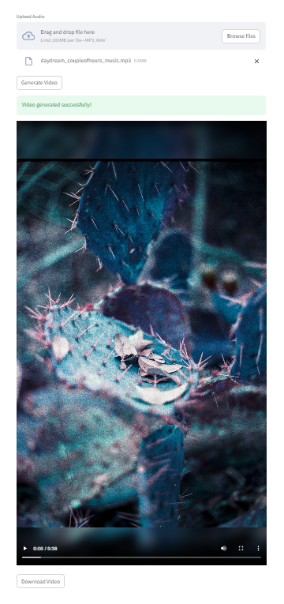

# Photo Beats 🎵✨  
**Animate your photos to the rhythm of your favorite audio tracks.**  

Photo Beats was created to simplify short video creation for photographers, artists, and anyone who loves visual storytelling but dislikes the hassle of editing. With just a few clicks, you can upload photos and audio, and Photo Beats will generate a perfectly synced video to the beat of your chosen track.  

## Features 🌟  
- **Effortless Photo Upload**: Supports `.png` and `.jpg` file formats.  
- **Audio Integration**: Upload audio tracks in `.mp3` or `.wav` formats.  
- **Beat Synchronization**: Your photos will transition in sync with the rhythm of your audio.  
- **Instant Preview**: Review your generated video before downloading.  
- **One-Click Download**: Export your video to share on social platforms or save for later.  

---

## Demo 🚀  
[Free Live Demo on Streamlit Community Cloud](https://photobeat.streamlit.app)

---

## Getting Started 🛠️  
Follow these steps to set up Photo Beats locally and start creating your videos.  

### Prerequisites  
- Python 3.8+  
- [Streamlit](https://streamlit.io/)  
- Install required libraries from `requirements.txt`.  

### Installation  
1. **Clone the repository**:  
   ```bash  
   git clone https://github.com/your-username/photo-beats.git  
   cd photo-beats  
   ```  

2. **Install dependencies**:  
   ```bash  
   pip install -r requirements.txt  
   ```  

3. **Run the application**:  
   ```bash  
   streamlit run app.py  
   ```  

4. **Access the app**:  
   Open your browser and navigate to `http://localhost:8501`.  

---

## How It Works ⚙️  
1. Upload your photo files (`.png` or `.jpg`).  
2. Upload an audio file (`.mp3` or `.wav`).  
3. Click **Submit** to process your video.  
4. Preview your video to ensure it meets your expectations.  
5. Download your final video to share or save.  

---

## Screenshots 📸  
### Upload Interface:  


### Video Preview:  


### Example Video:
[Example Reel by @TrippingCherry on IG](https://www.instagram.com/p/DCdMUGoBY7-/)

---

## Technologies Used 🖥️  
- **Framework**: [Streamlit](https://streamlit.io/)  
- **Video Processing**: [MoviePy](https://zulko.github.io/moviepy/).  
- **Audio Processing**: [Librosa](https://librosa.org/).

---

## Roadmap 🗺️  
- **Future Features**:  
  - Add support for custom photo transition effects. 
  - Add sample audio library.
  - Add mp3 extraction from video url
  - Enable text overlays on photos.  
  - Provide different video output resolutions.  
  - Include cloud-based hosting for easier sharing and performance improvement. 

---

## Contributing 🤝  
Contributions are welcome! If you have ideas or enhancements, feel free to open an issue or submit a pull request.  

1. Fork the repository.  
2. Create a new branch for your feature or bugfix:  
   ```bash  
   git checkout -b feature-name  
   ```  
3. Commit your changes:  
   ```bash  
   git commit -m "Add feature-name"  
   ```  
4. Push to your branch:  
   ```bash  
   git push origin feature-name  
   ```  
5. Open a pull request in the main repository.  

---

## License 📜  
This project is licensed under the [MIT License](LICENSE).  

---

## Acknowledgments 🙏  
- Inspired by the love of photography and music.  
- [Sign up for my photography newsletter:](https://tripping-cherry.ghost.io)
- Thanks to the creators of [Streamlit](https://streamlit.io/), [MoviePy](https://zulko.github.io/moviepy/), and [Librosa](https://librosa.org/).  

---
